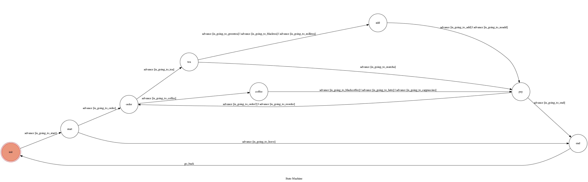
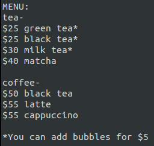

# TOC Project 2017

Template Code for TOC Project 2017

A telegram bot based on a finite state machine

## Setup

### Prerequisite
* Python (can't install pygraphviz on Python3)

#### Install Dependency
```sh
pip install -r requirements.txt
```

* pygraphviz (For visualizing Finite State Machine)
    * [Setup pygraphviz on Ubuntu](http://www.jianshu.com/p/a3da7ecc5303)

### Secret Data

`API_TOKEN` and `WEBHOOK_URL` in app.py **MUST** be set to proper values.
Otherwise, you might not be able to run your code.

### Run Locally
You can either setup https server or using `ngrok` as a proxy.

**`ngrok` would be used in the following instruction**

```sh
ngrok http 5000
```

After that, `ngrok` would generate a https URL.

You should set `WEBHOOK_URL` (in app.py) to `your-https-URL/hook`.

#### Run the sever

```sh
python app.py
```

## Finite State Machine



## Usage
The initial state is set to `init`.

Programmed for ordering drinks.
4 kinds of tea and 3 kinds of coffee.
You can add bubble for 3 kinds of tea.
Order as many drinks as you want and pay at once.
Total price will be shown at the end.



## Author
f74036035 Yo22617
